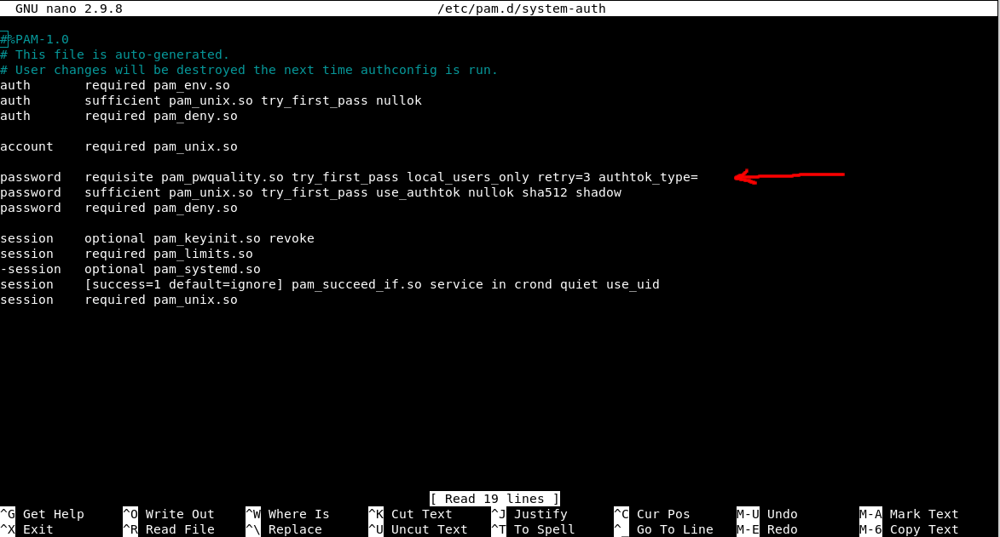
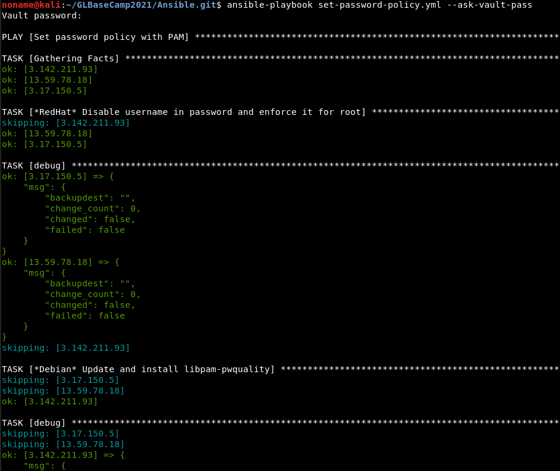
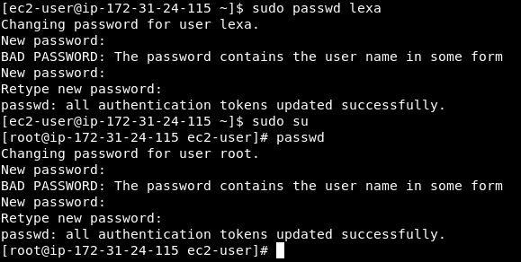
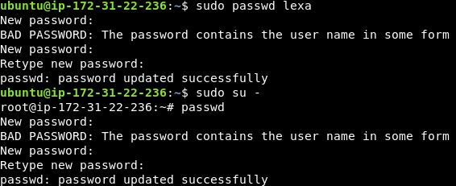
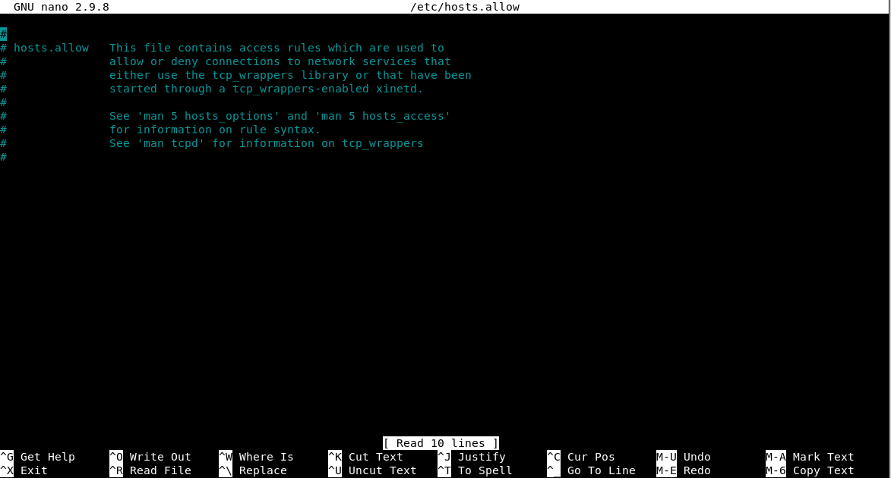
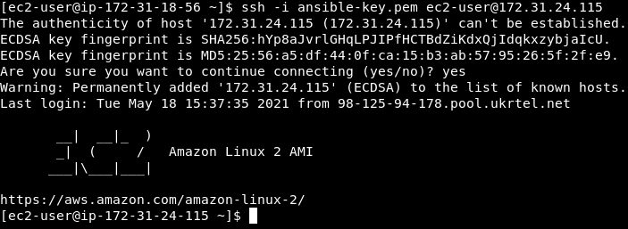
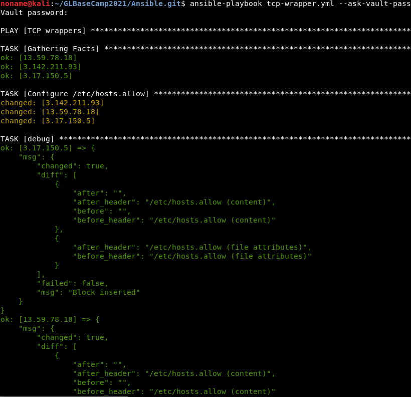
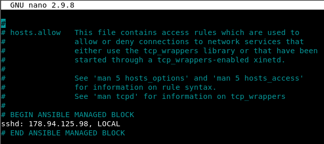
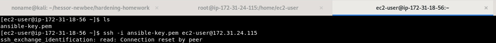
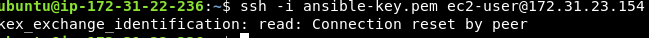

# ansible-vault password: hessor
# Task #1
## 1. set-password-policy.yml
```yaml
---
- name: Set password policy with PAM
  hosts: all
  gather_facts: true
  become: true

  tasks:
    - block:
      - name: "*RedHat* Disable username in password and enforce it for root" 
        pamd:
          name: system-auth
          type: password
          control: requisite
          module_path: pam_pwquality.so
          module_arguments: 'try_first_pass 
            local_users_only
            retry=3
            minlen=10
            dcredit=3
            ucredit=2 
            gecoscheck=1
            authtok_type= enforce_for_root'
          state: updated
        register: result
  
      - debug:
          msg: "{{ result }}"
      
      when: ansible_os_family == 'RedHat'
   
    - block:
      - name: "*Debian* Update and install libpam-pwquality"
        apt:
          update_cache: true
          force_apt_get: true
          name: libpam-pwquality
          state: present
        register: result 
    
      - debug:
          msg: "{{ result }}"
      
      - name: "*Debian* Disable username in password and enforce it for root"
        pamd:
          name: common-password
          type: password
          control: requisite
          module_path: pam_pwquality.so
          module_arguments: 'try_first_pass
            local_users_only
            retry=3
            minlen=10
            dcredit=3
            ucredit=2
            gecoscheck=1
            authtok_type= enforce_for_root'
          state: updated
        register: result
      
      - debug:
          msg: "{{ result}}"
      
      when: ansible_os_family == 'Debian'
```
## 2. Check /etc/pam.d/system-auth before running playbook.

## 3. Run set-password-policy.yml.

## 4. Check /etc/pam.d/system-auth.

## 5. Testing:
   - logged in to VM;
   - created a user "lexa";
   - tried to set invalid password;
   - the same for root.<br>

RedHat



Debian


# Task #2
## 1. tcp-wrapper.yml
```yaml
---
- name: TCP wrappers
  hosts: all
  become: true
  gather_facts: true

  tasks:
    - name: Configure /etc/hosts.allow
      blockinfile:
        path: /etc/hosts.allow
        block: |
          sshd: 178.94.125.98, LOCAL
      register: result

    - debug:
        msg: "{{ result }}"

    - name: Configure /etc/hosts.deny
      blockinfile:
        path: /etc/hosts.deny
        block: |
          sshd: ALL
          ALL : ALL
      register: result

    - debug:
        msg: "{{ result }}"
```
## 2. Check /etc/hosts.allow and /etc/hosts.deny before running playbook.

## 3. Try to log in via ssh from VM #2 to VM #1.

## 4. Run tcp-wrapper.yml.

## 5. Check /etc/hosts.allow and deny.

## 6. Testing:
   - logged in to VM #2 and #3;
   - tried to log in to VM #1.

From Redhat to Redhat



From Debian to Redhat



